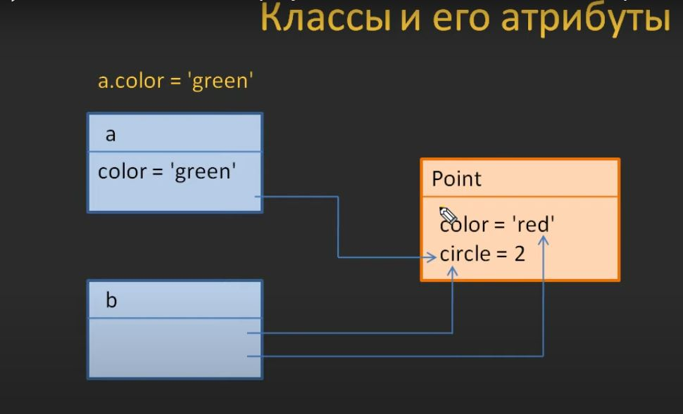
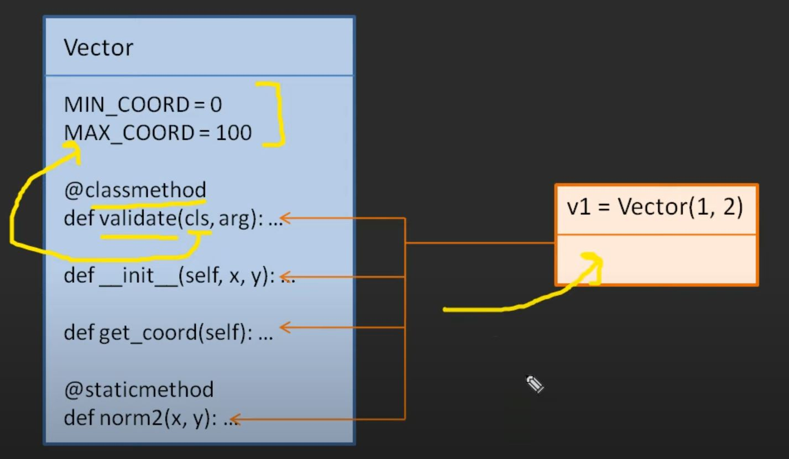

# Python OOP Youtube
## Lesson 1: Классы и объекты. Атрибуты классов и объектов
1. Ссылки на атрибуты класса:

2. Добавление своего атрибута в переменную:

3.  Добавление новых атрибутов(сохранение взаимосвязи):

4. Итог:

## Lesson 2: Методы классов. Параметр self
1. Передача self:

2. Значение self для метода(для чего его создали):

## Lesson 3: Инициализатор __init__ и финализатор __del__
1. Инициализатор __init__ и финализатор __del__(start)

2. Инициализатор __init__ (Принцип действия)

3. Финализатор __del__ (принцип действия)
Работает по принципу: пока есть внешняя ссылка на 
объект-нужен(обратное-не нужен(__del__ подчищает))

## Lesson 4: Магический метод __new__. Пример паттерна Singleton
1. Магический метод __new__(start)

2. Иерархи классов по умолчанию:

3. Паттерн Singleton:

## Lesson 5: Методы класса (classmethod) и статические методы (staticmethod)
1. @classmethod: прописывать имя класса внутри самого класса это плохая практика, лучше использовать
cls/self так программа становится более универсальной

2. Простой случай с методами

3. Наглядно про обращение через @classmethod

4. @staticmethod предлагается использовать только переданными аргументами

## Lesson 6: Режимы доступа public, private, protected. Сеттеры и геттеры
1. Механизм инкапсуляции

2. getter and setter (интерфейсные методы)

3. Дополнительный модуль для работы с приватными методами

## Lesson 7: Магические методы __setattr__, __getattribute__, __getattr__ и __delattr__
1. Четыре магических методов

2. 